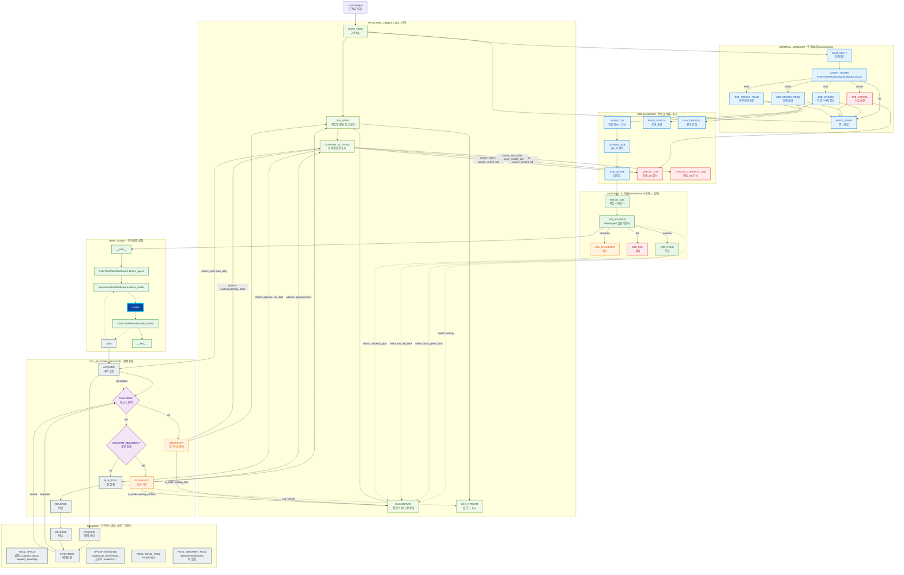
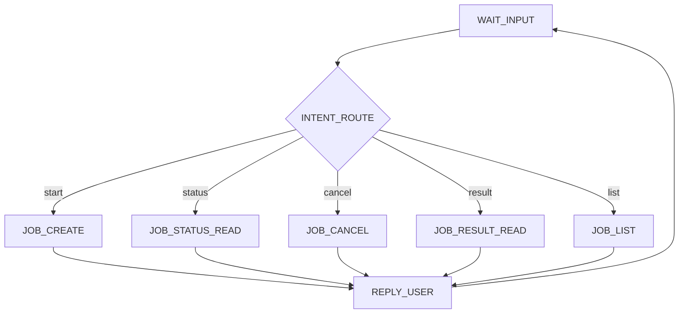

# 에이전트 세계관 플로우차트 (Mermaid 전용, v3)

아래 Mermaid 코드를 Mermaid Live Editor에 붙여넣어 확인하세요.

## GM 라우팅 노드 구성도 (Mermaid)

> 참고: GeneralManager는 LangGraph로 구현한다. DeepAgent는 워커 내부 실행기이며, ToolRuntimeAdapter가 ToolBox 정책을 강제한다.
