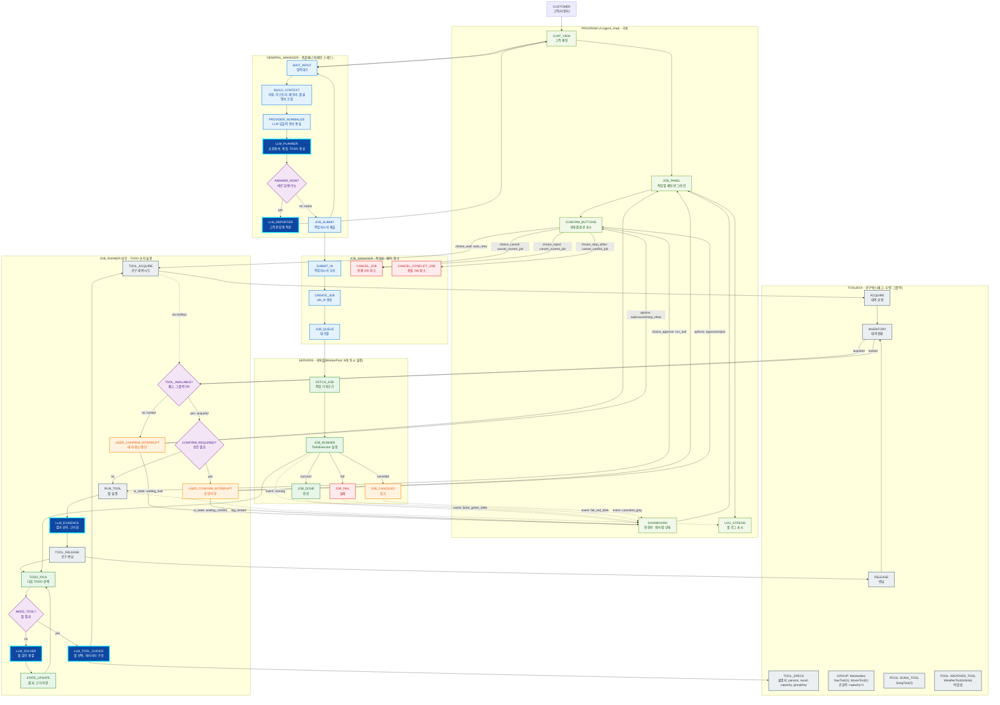

# 에이전트 세계관 플로우차트 (Mermaid 전용, v3)

아래 Mermaid 코드를 Mermaid Live Editor에 붙여넣어 확인하세요.

```mermaid
flowchart TB

%% =========================
%% STYLE DEFINITIONS
%% =========================
classDef ui fill:#F1F8E9,stroke:#7CB342,stroke-width:2px,color:#1B5E20;
classDef main fill:#E3F2FD,stroke:#1E88E5,stroke-width:2px,color:#0D47A1;
classDef worker fill:#E8F5E9,stroke:#43A047,stroke-width:2px,color:#1B5E20;
classDef tool fill:#ECEFF1,stroke:#546E7A,stroke-width:2px,color:#263238;

classDef decision fill:#F3E5F5,stroke:#8E24AA,stroke-width:2px,color:#4A148C;
classDef warn fill:#FFF3E0,stroke:#FB8C00,stroke-width:2px,color:#E65100;
classDef danger fill:#FFEBEE,stroke:#E53935,stroke-width:2px,color:#B71C1C;

%% LLM CALL (distinct)
classDef llm fill:#0D47A1,stroke:#00E5FF,stroke-width:4px,color:#FFFFFF;

%% =========================
%% UI (가게/전광판/작업패널)
%% =========================
subgraph UI["PROGRAM UI (agent_chat) - 가게"]
  U_CHAT["CHAT_VIEW<br/>고객 채팅"]:::ui
  U_BOARD["DASHBOARD<br/>전광판: 워커/잡 상태"]:::ui
  U_PANEL["JOB_PANEL<br/>작업별 채팅/로그/승인"]:::ui
  U_LOG["LOG_STREAM<br/>툴 로그 표시"]:::ui
  U_BTN["CONFIRM_BUTTONS<br/>상태별 옵션 표시"]:::ui

  U_CHAT --> U_PANEL
  U_BOARD --> U_PANEL
  U_PANEL --> U_LOG
  U_PANEL --> U_BTN
end

CUST["CUSTOMER<br/>고객(사용자)"] --> U_CHAT

%% =========================
%% GENERAL MANAGER (메인 스레드)
%% =========================
subgraph MAIN["GENERAL_MANAGER - 총괄매니저(메인 스레드)"]
  M_WAIT["WAIT_INPUT<br/>입력대기"]:::main
  M_CTX["BUILD_CONTEXT<br/>지침, 히스토리, 메모리, 툴설명서 조립"]:::main
  M_PROV["PROVIDER_NORMALIZE<br/>LLM 입출력 형식 통일"]:::main
  M_PLAN["LLM_PLANNER<br/>요청해석, 계획, TODO 생성"]:::llm
  M_DECIDE{"ANSWER_NOW?<br/>바로 답변 가능"}:::decision
  M_REPORT["LLM_REPORTER<br/>고객용 답변 작성"]:::llm
  M_SUBMIT["JOB_SUBMIT<br/>작업지시서 제출"]:::main

  M_WAIT --> M_CTX --> M_PROV --> M_PLAN --> M_DECIDE
  M_DECIDE -->|yes| M_REPORT --> U_CHAT --> M_WAIT
  M_DECIDE -->|no: todos| M_SUBMIT --> M_WAIT
end

U_CHAT --> M_WAIT

%% =========================
%% JOB MANAGER (작업표/배차/취소)
%% =========================
subgraph JM["JOB_MANAGER - 작업표, 배차, 취소"]
  JM_IN["SUBMIT_IN<br/>작업지시서 수신"]:::main --> JM_CREATE["CREATE_JOB<br/>job_id 생성"]:::main
  JM_CREATE --> JM_QUEUE["JOB_QUEUE<br/>대기열"]:::main
  JM_CANCEL["CANCEL_JOB<br/>현재 Job 취소"]:::danger
  JM_CANCEL_CONFLICT["CANCEL_CONFLICT_JOB<br/>충돌 Job 취소"]:::danger
end

M_SUBMIT --> JM_IN

%% =========================
%% SERVERS (워커 풀)
%% =========================
subgraph WP["SERVERS - 서버들(WorkerPool, N개 동시 실행)"]
  W_FETCH["FETCH_JOB<br/>작업 가져오기"]:::worker
  W_RUN["JOB_RUNNER<br/>TodoExecutor 실행"]:::worker
  W_DONE["JOB_DONE<br/>완료"]:::worker
  W_FAIL["JOB_FAIL<br/>실패"]:::danger
  W_CANC["JOB_CANCELED<br/>취소"]:::warn

  W_FETCH --> W_RUN
  W_RUN -->|success| W_DONE
  W_RUN -->|fail| W_FAIL
  W_RUN -->|canceled| W_CANC
end

JM_QUEUE --> W_FETCH

%% =========================
%% TOOLBOX (공구박스: 수량, 그룹락)
%% =========================
subgraph TBX["TOOLBOX - 공구박스(재고, 수량, 그룹락)"]
  T_SPEC["TOOL_SPECS<br/>설명서: params, result, capacity, groupKey"]:::tool
  T_INV["INVENTORY<br/>대여현황"]:::tool
  T_ACQ["ACQUIRE<br/>대여 요청"]:::tool
  T_REL["RELEASE<br/>반납"]:::tool

  T_MON["GROUP: MonitorBox<br/>NavTool(1), MovieTool(1)<br/>공유락: capacity=1"]:::tool
  T_SONG["POOL: SONG_TOOL<br/>SongTool(2)"]:::tool
  T_WEAT["POOL: WEATHER_TOOL<br/>WeatherTool(infinite)<br/>락 없음"]:::tool
end

%% =========================
%% JOB RUNNER 내부 (TODO 순차)
%% =========================
subgraph RUN["JOB_RUNNER 내부 - TODO 순차 실행"]
  R_PICK["TODO_PICK<br/>다음 TODO 선택"]:::worker
  R_NEED{"NEED_TOOL?<br/>툴 필요"}:::decision

  R_SOLVE["LLM_SOLVER<br/>툴 없이 해결"]:::llm
  R_UPD1["STATE_UPDATE<br/>결과, 근거 저장"]:::worker

  R_CHOOSE["LLM_TOOL_CHOICE<br/>툴 선택, 파라미터 구성"]:::llm
  R_ACQ["TOOL_ACQUIRE<br/>공구 대여 시도"]:::tool
  R_AVAIL{"TOOL_AVAILABLE?<br/>재고, 그룹락 OK"}:::decision

  R_WAIT_LOCK["USER_CONFIRM_INTERRUPT<br/>대기/취소/중단"]:::warn
  R_WAIT_CONFIRM["USER_CONFIRM_INTERRUPT<br/>승인/거부"]:::warn
  R_CONFIRM{"CONFIRM_REQUIRED?<br/>승인 필요"}:::decision
  R_EXEC["RUN_TOOL<br/>툴 실행"]:::tool
  R_REL["TOOL_RELEASE<br/>공구 반납"]:::tool
  R_UPD2["LLM_EVIDENCE<br/>결과 요약, 근거화"]:::llm

  R_PICK --> R_NEED

  R_NEED -->|no| R_SOLVE --> R_UPD1 --> R_PICK

  R_NEED -->|yes| R_CHOOSE --> R_ACQ
  R_AVAIL -->|yes: acquired| R_CONFIRM
  R_AVAIL -->|no: locked| R_WAIT_LOCK
  R_CONFIRM -->|no| R_EXEC --> R_UPD2 --> R_REL --> R_PICK
  R_CONFIRM -->|yes| R_WAIT_CONFIRM
end

W_RUN --> R_PICK

%% Toolbox wiring
R_CHOOSE --> T_SPEC
R_ACQ --> T_ACQ --> T_INV
T_INV -->|acquired| R_AVAIL
T_INV -->|locked| R_AVAIL
R_REL --> T_REL --> T_INV
R_ACQ -.->|via toolbox| R_AVAIL

%% User choice wiring (UI)
R_WAIT_LOCK -->|ui_state: waiting_lock| U_BOARD
R_WAIT_CONFIRM -->|ui_state: waiting_confirm| U_BOARD
R_WAIT_LOCK --> U_PANEL
R_WAIT_CONFIRM --> U_PANEL
R_WAIT_LOCK -->|options: wait/cancel/stop_other| U_BTN
R_WAIT_CONFIRM -->|options: approve/reject| U_BTN

U_BTN -->|choice_wait: auto_retry| R_ACQ
U_BTN -->|choice_cancel: cancel_current_job| JM_CANCEL
U_BTN -->|choice_stop_other: cancel_conflict_job| JM_CANCEL_CONFLICT
U_BTN -->|choice_approve: run_tool| R_EXEC
U_BTN -->|choice_reject: cancel_current_job| JM_CANCEL

%% UI status updates
W_RUN -.->|event: running| U_BOARD
W_DONE -.->|event: done_green_blink| U_BOARD
W_FAIL -.->|event: fail_red_blink| U_BOARD
W_CANC -.->|event: canceled_gray| U_BOARD
R_EXEC -.->|log_stream| U_LOG
```

> 참고: JobRunner 내부 흐름은 LangGraph를 고정 사용하여 그래프 노드/엣지로 모델링한다.
