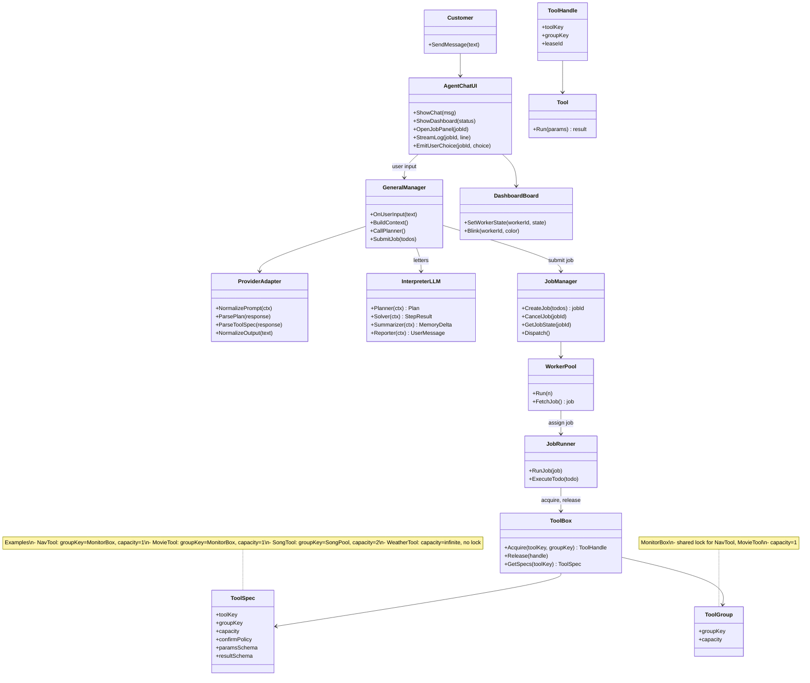
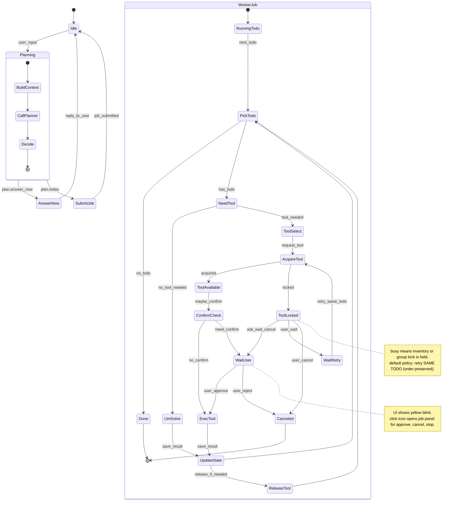

# 에이전트 세계관 모델링 (Mermaid)

## 1) 클래스 다이어그램

```mermaid
classDiagram
direction TB

class AgentChatUI {
  +ShowChat(msg)
  +ShowDashboard(status)
  +OpenJobPanel(jobId)
  +StreamLog(jobId, line)
  +EmitUserChoice(jobId, choice)
}

class Customer {
  +SendMessage(text)
}

class GeneralManager {
  +OnUserInput(text)
  +BuildContext()
  +CallPlanner()
  +SubmitJob(todos)
}

class ProviderAdapter {
  +NormalizePrompt(ctx)
  +ParsePlan(response)
  +ParseToolSpec(response)
  +NormalizeOutput(text)
}

class InterpreterLLM {
  +Planner(ctx) Plan
  +Solver(ctx) StepResult
  +Summarizer(ctx) MemoryDelta
  +Reporter(ctx) UserMessage
}

class JobManager {
  +CreateJob(todos) jobId
  +CancelJob(jobId)
  +GetJobState(jobId)
  +Dispatch()
}

class WorkerPool {
  +Run(n)
  +FetchJob() job
}

class JobRunner {
  +RunJob(job)
  +ExecuteTodo(todo)
}

class ToolBox {
  +Acquire(toolKey, groupKey) ToolHandle
  +Release(handle)
  +GetSpecs(toolKey) ToolSpec
}

class ToolSpec {
  +toolKey
  +groupKey
  +capacity
  +confirmPolicy
  +paramsSchema
  +resultSchema
}

class ToolHandle {
  +toolKey
  +groupKey
  +leaseId
}

class Tool {
  +Run(params) result
}

class ToolGroup {
  +groupKey
  +capacity
}

class DashboardBoard {
  +SetWorkerState(workerId, state)
  +Blink(workerId, color)
}

Customer --> AgentChatUI
AgentChatUI --> GeneralManager : user input
GeneralManager --> ProviderAdapter
GeneralManager --> InterpreterLLM : letters
GeneralManager --> JobManager : submit job

JobManager --> WorkerPool
WorkerPool --> JobRunner : assign job
JobRunner --> ToolBox : acquire, release
ToolBox --> ToolSpec
ToolBox --> ToolGroup
ToolHandle --> Tool
AgentChatUI --> DashboardBoard

note for ToolGroup "MonitorBox\n- shared lock for NavTool, MovieTool\n- capacity=1"
note for ToolSpec "Examples\n- NavTool: groupKey=MonitorBox, capacity=1\n- MovieTool: groupKey=MonitorBox, capacity=1\n- SongTool: groupKey=SongPool, capacity=2\n- WeatherTool: capacity=infinite, no lock"
```

## 2) 상태 머신(WorkerJob)

```mermaid
stateDiagram-v2

[*] --> Idle

Idle --> Planning : user_input
Planning --> AnswerNow : plan.answer_now
Planning --> SubmitJob : plan.todos

AnswerNow --> Idle : reply_to_user
SubmitJob --> Idle : job_submitted

state WorkerJob {
  [*] --> RunningTodo
  RunningTodo --> PickTodo : next_todo
  PickTodo --> Done : no_todo
  PickTodo --> NeedTool : has_todo

  NeedTool --> LlmSolve : no_tool_needed
  LlmSolve --> UpdateState : save_result
  UpdateState --> PickTodo

  NeedTool --> ToolSelect : tool_needed
  ToolSelect --> AcquireTool : request_tool

  AcquireTool --> ToolAvailable : acquired
  AcquireTool --> ToolLocked : locked

  ToolAvailable --> ConfirmCheck : maybe_confirm
  ConfirmCheck --> ExecTool : no_confirm
  ConfirmCheck --> WaitUser : need_confirm

  WaitUser --> ExecTool : user_approve
  WaitUser --> Canceled : user_reject

  ToolLocked --> WaitUser : ask_wait_cancel
  ToolLocked --> WaitRetry : user_wait
  WaitRetry --> AcquireTool : retry_same_todo
  ToolLocked --> Canceled : user_cancel

  ExecTool --> UpdateState : save_result
  UpdateState --> ReleaseTool : release_if_needed
  ReleaseTool --> PickTodo

  Done --> [*]
  Canceled --> [*]
}

state Planning {
  [*] --> BuildContext
  BuildContext --> CallPlanner
  CallPlanner --> Decide
  Decide --> [*]
}

note right of ToolLocked
busy means inventory or group lock is held.
default policy: retry SAME TODO (order preserved).
end note

note right of WaitUser
UI shows yellow blink.
click icon opens job panel for approve, cancel, stop.
end note
```

> 이 상태 그래프는 LangGraph를 고정 사용하여 구현하며, 노드별 LLM 호출은 ProviderAdapter로 분리한다.
