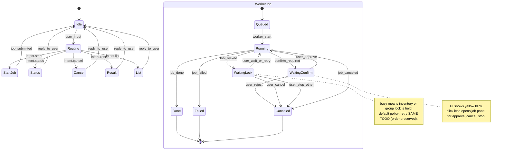

# 에이전트 세계관 모델링 (Mermaid)

## 1) 클래스 다이어그램

> DeepAgent 내부 그래프는 미들웨어 체인(PatchToolCalls -> Summarization -> model -> TodoList -> tools)로 동작하며, tools 호출은 ToolRuntimeAdapter를 통해 ToolBox를 확인한다.

## 2) 상태 머신(WorkerJob)

> GeneralManager는 LangGraph로 구현하며, DeepAgent는 워커 내부에서 장기 작업을 수행한다.
